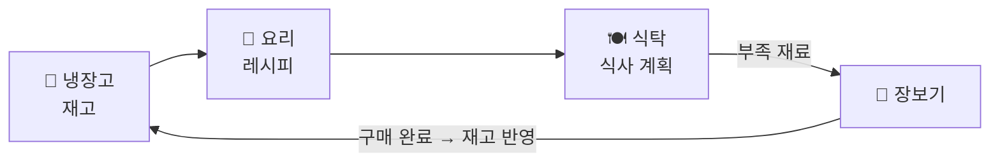

# 🍳 Smart Kitchen

> 냉장고 재고를 중심으로 **요리 → 식탁(식사 계획) → 장보기**가 자동으로 순환하는 식재료·식사 관리 모바일 앱.
> 기획 → 설계 → 개발 → 스토어 출시까지 전 과정을 혼자 진행하는 1인 프로젝트입니다.

## 핵심 컨셉

계획만 세우면 재고가 알아서 맞아 들어가는 폐쇄 루프. 사용자는 "조리 완료" 버튼을 누르지 않습니다.



- **무입력 재고 차감** — 식사 계획 등록 시 재고를 예약하고, 날짜가 지나면 배치가 자동 확정 (예약-확정 모델)
- **유통기한 배치 관리** — 구매 시점 단위(배치)로 재고를 관리하고 FEFO로 차감, 임박 알림으로 재방문 유도
- **입력 부담 최소화** — 식재료 마스터 선택만으로 보관 장소·단위·유통기한 자동 입력

## 기술 스택

| 영역 | 선택 |
| :---- | :---- |
| 앱 | Flutter (iOS / Android) |
| 백엔드 | Spring Boot 3 + Kotlin + JPA |
| DB | PostgreSQL |
| 인프라 | AWS Lightsail + Docker + GitHub Actions CI/CD |
| AI (확장) | 백엔드에서 VLM API 호출 — 사진 기반 식재료 인식 |

## 문서

개발에 앞서 기획·설계 문서를 먼저 완성하고, 모든 주요 결정을 근거와 함께 기록하며 진행합니다.

| 문서 | 내용 |
| :---- | :---- |
| [서비스 기획서](docs/01-서비스-기획서.md) | 문제 정의, 타겟, MVP 범위, 차별점 |
| [용어 정의서](docs/02-용어-정의서.md) | 도메인 용어와 화면 라벨 ↔ 엔티티 매핑 |
| [IA (정보 구조)](docs/03-IA-정보구조.md) | 탭 구조, 화면 목록, 핵심 이동 흐름 |
| [도메인 모델 정의서](docs/04-도메인-모델-정의서.md) | 엔티티 관계, 예약-확정·FEFO 등 핵심 규칙 |
| [ERD](docs/05-ERD.md) | PostgreSQL 테이블 설계 (DDL) |
| [Decision Log](docs/decisions/decision-log.md) | 주요 설계 결정 기록 — 검토한 대안 / 선택 / 근거 |

## 프로젝트 구조

```
smart-kitchen
├── docs/       # 기획·설계 문서 (개발보다 먼저 커밋됨)
├── backend/    # Spring Boot + Kotlin API 서버 (예정)
└── app/        # Flutter 앱 (예정)
```

## 진행 상태

- [x] 서비스 기획 및 설계 문서 v0.1 (2026-07)
- [ ] 개발환경 세팅
- [ ] 백엔드 API 개발
- [ ] Flutter 앱 개발
- [ ] 스토어 출시 (MVP)
- [ ] 확장: AI 사진 인식 (VLM)
