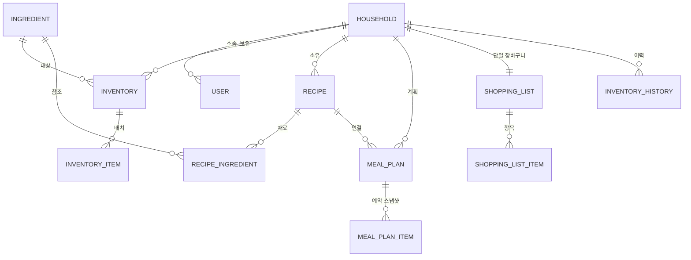

# 도메인 모델 정의서 — Smart Kitchen (가칭)

- 버전: v0.2 (초안) / 작성일: 2026-07-31 / 갱신일: 2026-08-03 (D-015 인분 모델 반영) / 상태: 검토 중
- 관련 문서: [용어 정의서](./02-용어-정의서.md) · [IA](./03-IA-정보구조.md) · [Decision Log](./decisions/decision-log.md)

---

## 1. 엔티티 관계 개요

## 2. 엔티티 정의

| 엔티티 | 역할 | 핵심 속성 | 규칙 |
| :---- | :---- | :---- | :---- |
| Household | 데이터 소유 단위 | name | 가입 시 자동 생성. 모든 조회는 household 스코프 (D-006) |
| User | 로그인 계정 | email, household_id | 하나의 가구에 소속 |
| Ingredient | 식재료 표준 정의 | name, category, unit_type, base_unit, package_name/size, default_storage, default_shelf_life, is_trackable, is_custom, household_id(커스텀만) | 마스터는 household_id = null. 커스텀은 소유 가구에서만 조회 (D-005) |
| Inventory | 식재료별 재고 집계 | household_id, ingredient_id, quantity, reserved_quantity | (household, ingredient) 당 1행. quantity = 배치 합계 (D-002, D-003) |
| InventoryItem | 배치 (재고 실체) | inventory_id, quantity, expiry_date, purchased_at | 구매 시점 단위. FEFO 차감 대상 (D-003) |
| Recipe | 요리 | household_id, name, servings(기준 인분) | MVP는 재료 목록만 (D-009). 재료량은 기준 인분 만들 때의 양 (D-015) |
| RecipeIngredient | 요리의 재료 | recipe_id, ingredient_id, quantity | 단위는 ingredient의 base_unit 고정 (D-004) |
| MealPlan | 식사 계획 | household_id, recipe_id, plan_date, meal_type(아침/점심/저녁), servings(선택 인분), status | 등록 시 재고 예약 (D-002, D-012). 기본 인분 = 요리의 기준 인분 (D-015) |
| MealPlanItem | 계획별 예약 스냅샷 | meal_plan_id, ingredient_id, required_qty, reserved_qty | 취소·수정 시 롤백의 근거. "있는 만큼 사용" 선택이 반영됨 (D-010) |
| ShoppingList | 장바구니 | household_id | 가구당 활성 1개 (D-009) |
| ShoppingListItem | 장보기 항목 | list_id, ingredient_id, quantity, is_checked, source(수동/부족) | 구매 완료 시 배치 생성으로 전환 |
| InventoryHistory | 재고 변동 이력 | household_id, ingredient_id, type, quantity, ref_id | type: 입고/차감확정/폐기/수정 |

## 3. 핵심 도메인 규칙

**R-1. 예약-확정 (D-002)**

- 계획 등록: `MealPlanItem` 생성(필요량·예약량 기록) + `Inventory.reserved_quantity` 증가. 배치는 지정하지 않는다.
- 필요량 계산: **재료량 × (MealPlan.servings ÷ Recipe.servings)** (D-015).
- 가용 부족 시: 부족 안내 화면(D-010)에서 "있는 만큼 사용" 선택 → `reserved_qty = min(가용, 필요량)`. "장보기 담기" → `ShoppingListItem(source=부족)` 생성.
- 확정: 배치 작업이 `plan_date < today`인 PLANNED 계획을 찾아 FEFO로 `InventoryItem`을 차감하고 reserved를 해제, `InventoryHistory(차감확정)` 기록, 상태를 CONFIRMED로 변경.
- 확정 시점에 실물이 예약량보다 적으면 있는 만큼만 차감한다(음수 재고 없음).
- 취소·수정: PLANNED 상태에서만 가능. `MealPlanItem`의 예약량만큼 reserved를 되돌린다. 이력 역분개 불필요.

**R-2. FEFO (D-003)**

- 차감 순서: `expiry_date` 오름차순 → 같으면 `purchased_at` 오름차순. `expiry_date`가 null인 배치는 마지막.
- 배치 수량이 0이 되면 소진 처리한다.

**R-3. 단위 (D-004)**

- 모든 수량 연산은 해당 식재료의 `base_unit`으로만 수행한다. 포장 단위는 표시 계층에서만 변환한다.

**R-4. 정량 관리 제외 (D-004)**

- `is_trackable = false` 품목은 보유 여부만 관리한다(수량·예약·부족 판단·FEFO 제외). 장보기에는 수동으로만 담긴다.

**R-5. 유통기한 임박 (D-013)**

- 임박 기준: `expiry_date - today <= 3일` (D-3부터 임박).
- 푸시 알림: 임박 또는 만료 항목이 있는 가구에 매일 09:00 요약 푸시 1건 발송(알림 허용자 한정). 항목이 처리될 때까지 매일 반복. 착지점은 냉장고 탭 임박 섹션 (D-012).
- 화면 표시: 재고 목록에서 임박 항목은 **D-3 / D-2 / D-1 배지**, 유통기한 경과 항목은 **빨간색 "만료" 표시**. 알림 비허용 사용자의 보완 채널.
- 유통기한 당일(D-0)은 **임박**으로 취급한다(만료 아님) — "경과 시 만료"이므로 당일은 아직 경과 전. 배지 D-0, 만료는 dday < 0부터 (D-020).
- 확장 여지: 사용자별 임박 일수 설정, 카테고리별 차등 기준.

**R-6. 배치 작업 2종 (D-011)**

| 작업 | 주기 | 내용 |
| :---- | :---- | :---- |
| 예약 확정 | 매일 00:10 | 날짜 경과한 PLANNED 계획의 예약분을 FEFO 차감으로 확정 |
| 임박 알림 | 매일 09:00 | 임박 배치 집계 → 가구별 푸시 발송 |

Spring `@Scheduled`로 시작하고, 필요 시 Spring Batch로 전환한다.

## 4. 상태 정의

| 대상 | 상태 | 전이 |
| :---- | :---- | :---- |
| MealPlan | PLANNED → CONFIRMED / CANCELED | 등록 → 배치 확정 / 사용자 취소(PLANNED에서만) |
| ShoppingListItem | 담김 → 체크 → 완료 | 완료 시 배치 생성 후 목록에서 제거 |
| InventoryHistory.type | 입고 / 차감확정 / 폐기 / 수정 | 이력은 불변(append-only) |

## 5. 확정 필요 사항

| 항목 | 상태 | 비고 |
| :---- | :---- | :---- |
| 임박 기준·알림·배치 시각 | **확정 (D-013)** | 3일 / 매일 09:00 요약 푸시 / 확정 배치 00:10 |
| 소셜 로그인 범위 | 미정 | iOS 출시 시 Apple 로그인 필수 고려. 개발 단계 확정 |
