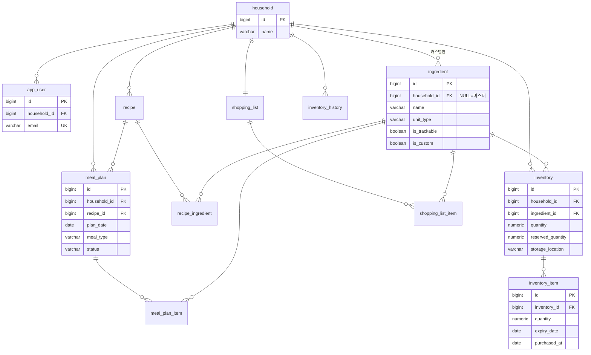

# ERD — Smart Kitchen (가칭)

- 버전: v1.0 (**확정**) / 작성일: 2026-07-31 / 확정일: 2026-08-03 / 스키마 반영: Flyway `V1__init.sql` (D-016)
- 기준: PostgreSQL (D-011) / 관련 문서: [도메인 모델 정의서](./04-도메인-모델-정의서.md)

---

## 1. ERD 다이어그램



## 2. 테이블 정의 (DDL)

```sql
CREATE TABLE household (
    id          BIGINT GENERATED ALWAYS AS IDENTITY PRIMARY KEY,
    name        VARCHAR(50) NOT NULL,
    created_at  TIMESTAMPTZ NOT NULL DEFAULT now()
);

CREATE TABLE app_user (
    id            BIGINT GENERATED ALWAYS AS IDENTITY PRIMARY KEY,
    household_id  BIGINT NOT NULL REFERENCES household(id),
    email         VARCHAR(255) NOT NULL UNIQUE,
    nickname      VARCHAR(30),
    -- 인증 컬럼(password_hash / provider 등)은 로그인 방식 확정 후 추가 (미정)
    created_at    TIMESTAMPTZ NOT NULL DEFAULT now()
);

CREATE TABLE ingredient (
    id                        BIGINT GENERATED ALWAYS AS IDENTITY PRIMARY KEY,
    household_id              BIGINT REFERENCES household(id),  -- NULL = 시스템 마스터 (D-005)
    name                      VARCHAR(50) NOT NULL,
    category                  VARCHAR(30) NOT NULL,
    unit_type                 VARCHAR(10) NOT NULL CHECK (unit_type IN ('COUNT','WEIGHT','VOLUME')),  -- D-004
    package_name              VARCHAR(20),                      -- 예: "모" (표시 전용)
    package_size              NUMERIC(10,2),                    -- 예: 300 (g)
    default_storage           VARCHAR(10) NOT NULL CHECK (default_storage IN ('FRIDGE','FREEZER','PANTRY')),
    default_shelf_life_days   INT,                              -- D-005, D-007
    is_trackable              BOOLEAN NOT NULL DEFAULT true,    -- D-004
    is_custom                 BOOLEAN NOT NULL DEFAULT false,
    created_at                TIMESTAMPTZ NOT NULL DEFAULT now()
);
-- 마스터/커스텀 각각의 이름 중복 방지 (부분 유니크 인덱스)
CREATE UNIQUE INDEX ux_ingredient_master_name ON ingredient(name) WHERE household_id IS NULL;
CREATE UNIQUE INDEX ux_ingredient_custom_name ON ingredient(household_id, name) WHERE household_id IS NOT NULL;

CREATE TABLE inventory (
    id                 BIGINT GENERATED ALWAYS AS IDENTITY PRIMARY KEY,
    household_id       BIGINT NOT NULL REFERENCES household(id),
    ingredient_id      BIGINT NOT NULL REFERENCES ingredient(id),
    quantity           NUMERIC(10,2) NOT NULL DEFAULT 0 CHECK (quantity >= 0),          -- 실물 보유량 = 배치 합계
    reserved_quantity  NUMERIC(10,2) NOT NULL DEFAULT 0 CHECK (reserved_quantity >= 0), -- D-002
    storage_location   VARCHAR(10) NOT NULL CHECK (storage_location IN ('FRIDGE','FREEZER','PANTRY')),
    UNIQUE (household_id, ingredient_id)
);

CREATE TABLE inventory_item (  -- 배치 (D-003)
    id            BIGINT GENERATED ALWAYS AS IDENTITY PRIMARY KEY,
    inventory_id  BIGINT NOT NULL REFERENCES inventory(id),
    quantity      NUMERIC(10,2) NOT NULL CHECK (quantity >= 0),
    expiry_date   DATE,                                  -- NULL 허용, FEFO 마지막 순서
    purchased_at  DATE NOT NULL DEFAULT CURRENT_DATE,
    created_at    TIMESTAMPTZ NOT NULL DEFAULT now()
);
-- FEFO 차감 순서 조회용 (R-2)
CREATE INDEX ix_inventory_item_fefo ON inventory_item(inventory_id, expiry_date NULLS LAST, purchased_at);
-- 임박 배치 집계용 (R-5)
CREATE INDEX ix_inventory_item_expiry ON inventory_item(expiry_date) WHERE expiry_date IS NOT NULL;

CREATE TABLE recipe (
    id            BIGINT GENERATED ALWAYS AS IDENTITY PRIMARY KEY,
    household_id  BIGINT NOT NULL REFERENCES household(id),
    name          VARCHAR(50) NOT NULL,
    servings      INT NOT NULL DEFAULT 1 CHECK (servings > 0),  -- 기준 인분 (D-015)
    created_at    TIMESTAMPTZ NOT NULL DEFAULT now()
);

CREATE TABLE recipe_ingredient (
    id             BIGINT GENERATED ALWAYS AS IDENTITY PRIMARY KEY,
    recipe_id      BIGINT NOT NULL REFERENCES recipe(id) ON DELETE CASCADE,
    ingredient_id  BIGINT NOT NULL REFERENCES ingredient(id),
    quantity       NUMERIC(10,2) NOT NULL CHECK (quantity > 0),  -- 단위는 ingredient 기본 단위 고정 (D-004)
    UNIQUE (recipe_id, ingredient_id)
);

CREATE TABLE meal_plan (
    id            BIGINT GENERATED ALWAYS AS IDENTITY PRIMARY KEY,
    household_id  BIGINT NOT NULL REFERENCES household(id),
    recipe_id     BIGINT NOT NULL REFERENCES recipe(id),
    plan_date     DATE NOT NULL,
    meal_type     VARCHAR(10) NOT NULL CHECK (meal_type IN ('BREAKFAST','LUNCH','DINNER')),  -- D-012
    servings      INT NOT NULL CHECK (servings > 0),  -- 선택 인분, 기본값은 recipe.servings (D-015)
    status        VARCHAR(10) NOT NULL DEFAULT 'PLANNED' CHECK (status IN ('PLANNED','CONFIRMED','CANCELED')),
    created_at    TIMESTAMPTZ NOT NULL DEFAULT now()
);
CREATE INDEX ix_meal_plan_calendar ON meal_plan(household_id, plan_date);       -- 주간 캘린더 조회
CREATE INDEX ix_meal_plan_batch ON meal_plan(status, plan_date);                -- 확정 배치 조회 (R-6)

CREATE TABLE meal_plan_item (  -- 계획별 예약 스냅샷 (R-1, D-010)
    id             BIGINT GENERATED ALWAYS AS IDENTITY PRIMARY KEY,
    meal_plan_id   BIGINT NOT NULL REFERENCES meal_plan(id) ON DELETE CASCADE,
    ingredient_id  BIGINT NOT NULL REFERENCES ingredient(id),
    required_qty   NUMERIC(10,2) NOT NULL CHECK (required_qty > 0),
    reserved_qty   NUMERIC(10,2) NOT NULL CHECK (reserved_qty >= 0),  -- "있는 만큼 사용" 시 required보다 작을 수 있음
    UNIQUE (meal_plan_id, ingredient_id)
);

CREATE TABLE shopping_list (
    id            BIGINT GENERATED ALWAYS AS IDENTITY PRIMARY KEY,
    household_id  BIGINT NOT NULL UNIQUE REFERENCES household(id)  -- 가구당 1개 (D-009)
);

CREATE TABLE shopping_list_item (
    id             BIGINT GENERATED ALWAYS AS IDENTITY PRIMARY KEY,
    list_id        BIGINT NOT NULL REFERENCES shopping_list(id),
    ingredient_id  BIGINT NOT NULL REFERENCES ingredient(id),
    quantity       NUMERIC(10,2) NOT NULL CHECK (quantity > 0),
    is_checked     BOOLEAN NOT NULL DEFAULT false,
    source         VARCHAR(10) NOT NULL DEFAULT 'MANUAL' CHECK (source IN ('MANUAL','SHORTAGE')),  -- D-010
    created_at     TIMESTAMPTZ NOT NULL DEFAULT now(),
    UNIQUE (list_id, ingredient_id)  -- 같은 식재료는 수량 합산으로 병합
);

CREATE TABLE inventory_history (
    id             BIGINT GENERATED ALWAYS AS IDENTITY PRIMARY KEY,
    household_id   BIGINT NOT NULL REFERENCES household(id),
    ingredient_id  BIGINT NOT NULL REFERENCES ingredient(id),
    type           VARCHAR(10) NOT NULL CHECK (type IN ('PURCHASE','CONSUME','DISPOSE','ADJUST')),
    quantity       NUMERIC(10,2) NOT NULL,   -- 증가 +, 감소 -
    ref_type       VARCHAR(20),              -- 예: MEAL_PLAN, SHOPPING_LIST
    ref_id         BIGINT,
    created_at     TIMESTAMPTZ NOT NULL DEFAULT now()
);
CREATE INDEX ix_history_lookup ON inventory_history(household_id, ingredient_id, created_at DESC);
```

## 3. 설계 노트

- **수량 타입**: 전부 `NUMERIC(10,2)` 통일. g/ml 단위의 소수 입력(예: 0.5개)과 계산 오차 방지.
- **enum 처리**: PostgreSQL enum 타입 대신 `VARCHAR + CHECK` 사용. JPA `@Enumerated(STRING)`과 호환되고 값 추가 시 마이그레이션이 단순하다.
- **마스터/커스텀 이름 중복**: 부분 유니크 인덱스 2개로 처리. 마스터끼리, 같은 가구의 커스텀끼리만 이름 유일성을 강제한다 (D-005).
- **FEFO 인덱스**: `(inventory_id, expiry_date NULLS LAST, purchased_at)` — 차감 순서 규칙(R-2)을 인덱스 순서로 그대로 표현.
- **배치 잡 인덱스**: `(status, plan_date)` — 매일 00:10 확정 배치가 `status='PLANNED' AND plan_date < today`로 조회 (R-6).
- **storage_location을 inventory에 배치**: 도메인 모델 대비 추가된 컬럼. 보관 장소 필터(S-11)의 기준이며, 등록 시 `ingredient.default_storage`로 초기화하고 사용자가 변경할 수 있게 한다(예: 두부를 냉동 보관).
- **user_id가 아닌 household_id 스코프**: 모든 도메인 테이블의 FK가 household를 향한다 (D-006). 조회 쿼리는 항상 `household_id =` 조건을 포함한다.
- **삭제 정책**: 도메인 데이터는 물리 삭제하지 않고 이력(`inventory_history`)으로 추적한다. `recipe_ingredient`, `meal_plan_item`만 부모 삭제 시 CASCADE.

## 4. 미정 사항

| 항목 | 내용 | 확정 시점 |
| :---- | :---- | :---- |
| app_user 인증 컬럼 | **해소 (D-018, 2026-08-03)** — `password_hash VARCHAR(100)` V3 추가. 소셜 로그인은 출시 전 재검토 | V3 마이그레이션 |
| ingredient.category 값 목록 | **13종 확정 (D-017, 2026-08-03)** — 채소·과일·정육/가공육/달걀·수산물/건해산·두부/콩/묵·우유/유제품·쌀/잡곡/견과·면/빵/통조림·양념/오일·김치/반찬·냉동/밀키트·커피/차/음료·기타 | V2 시드 반영 |
